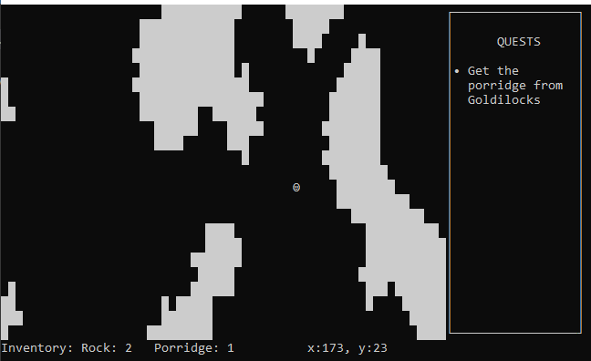
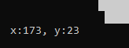
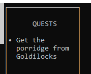
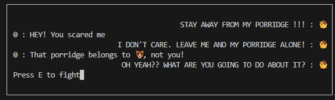
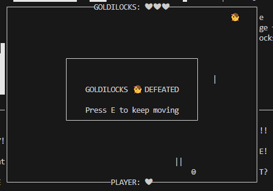
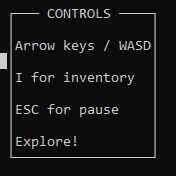
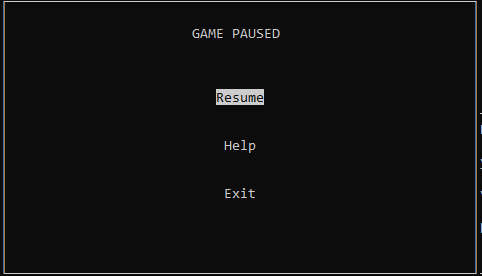

# Tiny Adventure

This is a small terminal adventure game in which you explore a strange cave like world and go on a quest

Note: The game has been deployed [here](https://tiny-adventure-c68de35594ff.herokuapp.com/), but the terminal its running on creates a few visual bugs.
      The overall gameplay experience will be much improved if you donwload the game first, and play it locally (You will need Python to run it)

## Features

---

### Map

- The map is made using cellular automata, and is randomly generated each time the game is run:

  - A random grid of 1s (walls) and 0s (empty space) is generated. The percentage of map that is wall tiles can be varied.

  - The smooth_map function loops through every tile, calling the count_neighbours function to count the number of surrounding wall tiles for each tile. If the number of neighbouring wall tiles is 4 or greater, the tile is set to a wall tile. if not, the tile is set to empty space.

  - Running the smooth_map function a few time results in the game map:

  - 

  - The map is randomly populated with rocks, "•". The player can pick them up by moving over them.

  - The map takes up most of the space in the game window:

  

### Player movement

- The player character is controlled using the arrow keys or wasd.

- Input validation

  - The player can move freely around the map, but moving into/over wall spaces is not allowed.

- The player's position on the map is tracked and displayed on the bottom right of the window.

### Inventory

- The player's inventory is displayed at the bottom of the window.

- The item type and quantity is displayed and updated every time the player picks up an item.

- The player can press "I" to show the inventory in a larger window.

### Quests

- The current quest is displayed on the right of the window, so that the player always knows what their next goal is.

- The quest is updated after the player recieves their quest.

- When all quests are complete, the quest window displays: "All quests complete"

### Dialogues

- A dialogue window will appear when the player is in range of the bear or Golilocks.

- Dialogue will change based on the quest status and player inventory.

- Dialogue is to provide a context for the player's quest.

### Fight with Goldilocks

- Player can initiate a bullet dodge style minigame.

- Player will control movement with "a" and "d" or the left and right arrow keys.

- Player can fire with the spacebar.

### Controls

- Controls are displayed on the bottom right of the window

### Pause

- Player can pause the game by pressing escape

- Pause window has scrollable options that highlight on selection (using arrow keys)

## Data Model

---

- The projectiles used in the fight between Goldilocks and the Player are spawned from the Projectile class.

  - The class stores the position and speed of the projectiles.

  - The class has an update position method to update the instance's position for the next game loop iteration.

  - The class is called to spawn both the player's and Goldilocks' projectiles - by changing the speed (1 or -1), the direction of the projectile changes as well.

## Testing

---

- The game has been extensively manually tested, including:

  - Using the CI PEP8 linter to confirm no problems.

  - Trying to move and do things in the game that should be forbidden.

  - Testing in local and deployed Heroku terminal.

## Validation

---

- This code was validated using the [CI PEP8 Validator](https://pep8ci.herokuapp.com/#)

  - Only error found was the use of a bare except.

    - This is fine because function called in try block does not give a specified error.

## Bugs

---

- Pause menu takes a second to appear after esc press in Heroku deployment.

  - Unsure if this is code issue or Heroku issue. If code issue, cannot recreate in any other terminal environment.

- Game is incredibly slow on Heroku - possibly due to infinite game loop refreshing constantly.

  - FIX: Only update game pad on user input.

- Game sometimes leaves artifacts on Heroku deployment.

  - This is an issue with the CI terminal, game works fine on other terminals

## Deployment

---

This game was deployed using the CI terminal on Heroku.

- Method to deploy:

  - Clone/Fork github repository.

  - Create a new Heroku app.

  - Add `Python` and `NodeJS` buildpacks.

  - Set environment variable: key = `PORT`, value = `8000`.

  - Link the app to the repository.

  - Deploy!

## Technologies used

---

- [Python](https://www.python.org/) for all of the game logic.

  - [curses](https://docs.python.org/3/library/curses.html) for all the visual aspects of the game.

  - [random](https://docs.python.org/3/library/random.html) to provide random code for map generation.

  - [time](https://docs.python.org/3/library/time.html) to provide timing funtions for minigame.

- [JavaScipt](https://www.javascript.com/) to provide the script to run the CI terminal.

- [HTML](https://developer.mozilla.org/en-US/docs/Web/HTML) to build the elements used in running the CI terminal.

## Credits

---

- Thank you to CI for providing me with the Github student account and the Heroku credits needed to deploy.

- Thank you to CI for porviding a mock terminal environment for deployment.

- Thank you to [Sebastian Lague](https://www.youtube.com/@SebastianLague) for his fantastic [cellular automata tutorial](https://www.youtube.com/watch?v=v7yyZZjF1z4&ab_channel=SebastianLague).

- Thank you to [Juliia Konovalova](https://github.com/IuliiaKonovalova) for being a stellar mentor and not freaking out when I was getting too close to the submission deadline with a lot left to do.