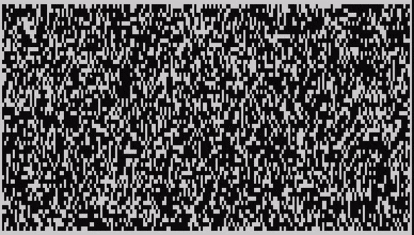

# Small Game Thing dot py

This is a small terminal adventure game

## Features

### Map

- The map is made using cellular automata, and is randomly generated each time the game is run:

  - A random grid of 1s (walls) and 0s (empty space) is generated. The percentage of map that is wall tiles can be varied.

  - The smooth_map function loops through every tile, calling the count_neighbours function to count the number of surrounding wall tiles for each tile. If the number of neighbouring wall tiles is 4 or greater, the tile is set to a wall tile. if not, the tile is set to empty space.

  - Running the smooth_map function a few time results in the game map:

  - 

## Bugs

- Pause menu takes a second to appear after esc press in Heroku deployment
  - Unsure if this is code issue or Heroku issue. If code issue, cannot recreate in any other terminal environment
